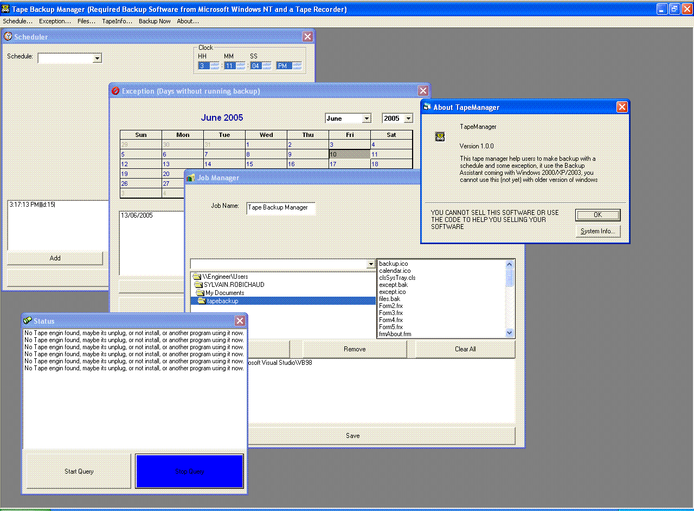



## Tape Manager \( using ntbackup \)

### Description

Did you ever use the backup assistant ( ntbackup.exe ) from Windows 2000/xp/2003 at work, and saw than the backup assist doesnt have anything to stop the backup job every holiday, its not a big thing you will say, but for me it is. If someone create something on the day before the holiday, and in the holiday someone delete that thing, if you dont change the tape you will loose that file, with this software you can stop the job on the holiday. First I thought maybe I could buy a software like veritas, but after I saw I could run backup assistant with the command prompt, and there is some api to help me for the tape status, so I started this on june 15th. Thing I need to do on that software, repair the montly stuff, make the exception windows more like the scheduler windows, make the software independant of the backup assistant (So I need to know how the API work for making a copy on a tape), I need to setup something to send an email when we need to change the tape, so I need to know how to manage multi tape, and the last thing, make my software a NT Services. All those thing will be done, if you can help me on something go ahead.
 
### More Info
 
Its an open source software, feel free to edit whatever you want, and feel free to post it back on planet-source-code. NOT COMPLETE.

             |
---                |---
**Submitted On**   |2005-06-17 15:11:26
**By**             |[Sylvain Robichaud](https://github.com/Planet-Source-Code/PSCIndex/blob/master/ByAuthor/sylvain-robichaud.md)
**Level**          |Intermediate
**User Rating**    |5.0 (10 globes from 2 users)
**Compatibility**  |VB 6\.0
**Category**       |[Complete Applications](https://github.com/Planet-Source-Code/PSCIndex/blob/master/ByCategory/complete-applications__1-27.md)
**World**          |[Visual Basic](https://github.com/Planet-Source-Code/PSCIndex/blob/master/ByWorld/visual-basic.md)
**Archive File**   |[Tape\_Manag1902846172005\.zip](https://github.com/Planet-Source-Code/sylvain-robichaud-tape-manager-using-ntbackup__1-61181/archive/master.zip)

